# 29. 关于Knife4j框架（续）

在使用Knife4j时，应该通过相关注解，将API文档配置得更加易于阅读和使用，可以（续）：

- `@ApiModelProperty`：添加在POJO类型的属性上，通过此注解的`value`属性可以配置请求参数的名称，通过此注解的`required`属性可以配置是否必须提交此请求参数（注意：此项配置值并不具备任何检查效果）

- `@ApiImplicitParam`：添加在处理请求的方法上，适用于请求参数不是POJO类型时，必须配置此注解的`name`属性，取值为请求参数的名称，表示当前注解是对哪个请求参数进行配置，然后，通过此注解的`value`属性可以配置请求参数的名称，通过此注解的`required`属性可以配置是否必须提交此请求参数（注意：此项配置值并不具备任何检查效果）。通过此注解的`dataType`属性配置请求参数的数据类型，常见取值有：`string`、`long`等

- `@ApiImplicitParams`：添加在处理请求的方法上，适用于请求参数不是POJO类型，且需要配置的参数的数量超过1个时，需要配置此注解的`value`属性，值是`@ApiImplicitParam`注解的数组类型，例如：

  ```java
  @ApiImplicitParams({
      @ApiImplicitParam(),
      @ApiImplicitParam(),
      @ApiImplicitParam()
  })
  ```

# 30. 【前端】安装VUE Cli

本项目的前端项目将使用“Vue脚手架”项目来开发，必须先在本机安装Node.js（可参考教程），然后，在命令提示符窗口中通过npm命令安装`@vue/cli`：

```
npm install -g @vue/cli
```

安装过程可能需要花点时间，并且，在窗口中可能提示`WARN`字样，整个安装过期其实并不用干预，只要没有出现错误（`ERR` / `ERROR`）字样即可。

如果安装过程卡住了，可以按下`Ctrl + C`（如果使用的是苹果电脑的MacOS也是按这个键）来终止当前命令的执行，并再次尝试执行安装命令即可。

安装过程如下图所示：

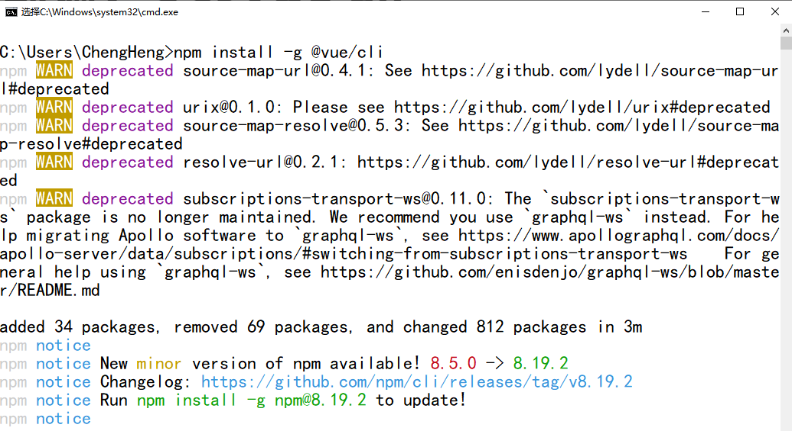

当安装完成后，可以通过以下命令来检查是否安装成功：

```
vue -V
```

注意：以上命令中的`-V`中的字母是大写的！

如果能够正常的显示版本号，则表示安装成功！

至此，当前计算机已经具备创建、开发、运行Vue脚手架项目的基本条件。

# 31. 创建Vue脚手架项目

在创建项目之前，先确定当前操作位置，例如：

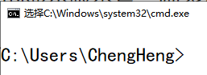

以上提示符表示当前的操作位置在：C盘下的`Users`文件夹下的`ChengHeng`文件夹下。

此操作位置决定了项目将被创建在此文件夹下。

通过`vue create 项目名称`命令即可创建项目，例如：

```
vue create jsd2207-csmall-web-client-teacher
```

当输入以上命令后，按1次回车键，此时可能会有一些卡顿，不要做任何操作，等待窗口的提示内容发生变化，然后，会进入创建向导，创建项目的各参数为：

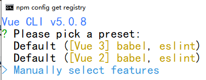

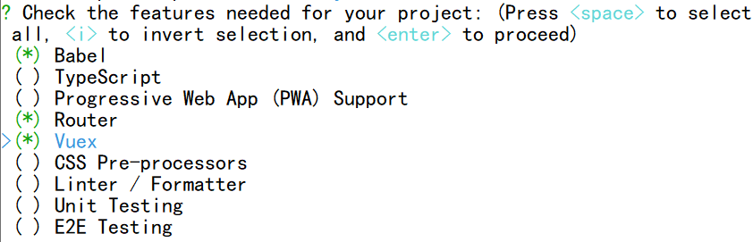

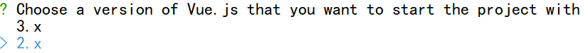


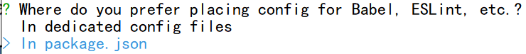

（最后还有一步，也是直接按回车键即可）

当全部选择完成后，会自动开始创建当前项目，最后，看到`Successfully`字样则表示创建成功，如下图所示：

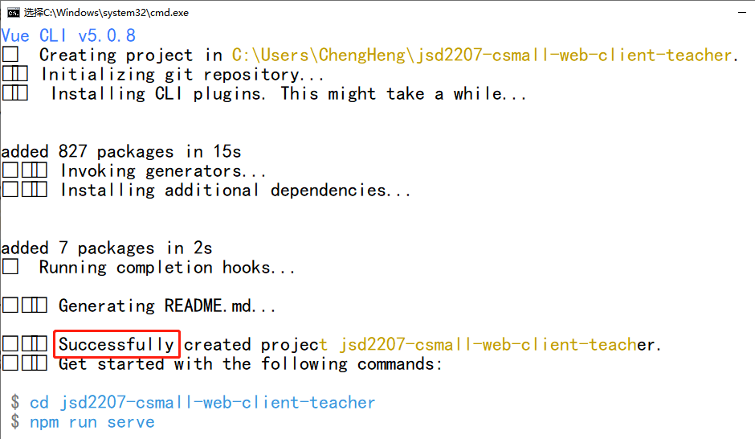

则可以在命令提示符对应的位置找到新创建的项目。

可以将项目移动到常用的文件夹中，并可以使用IntelliJ IDEA打开此项目：

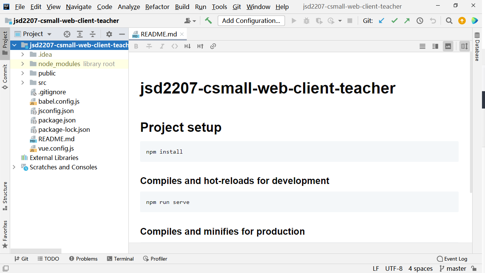

# 32. 启动Vue脚手架项目

在IntelliJ IDEA中打开项目后，点击下方的`Terminal`即可打开**终端**面板

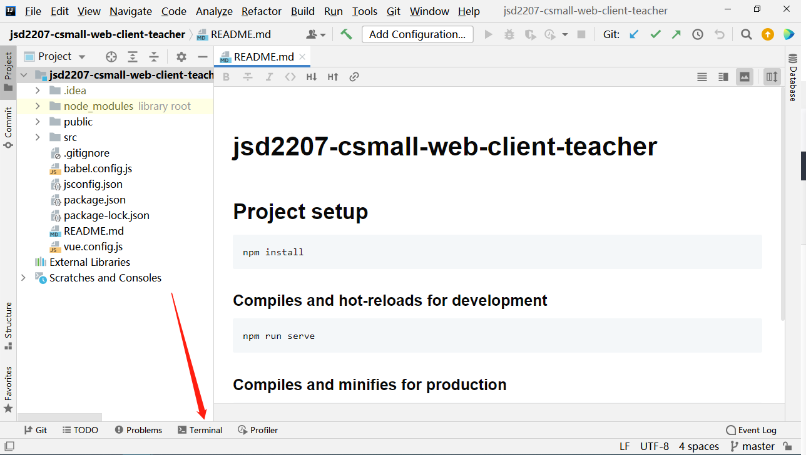

在**终端**窗口中，执行`npm run serve`命令，即可启动当前项目，当启动成功后，可以看到`successfully`字样，如下图所示：

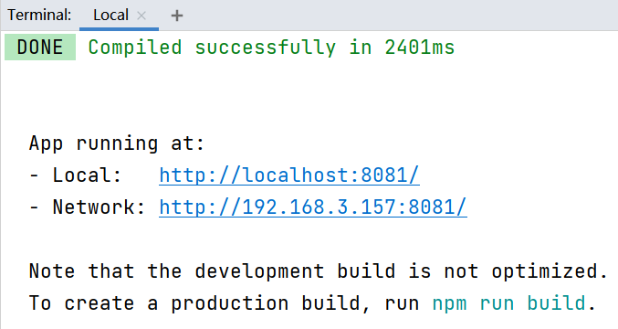

根据提示的URL，在浏览器中打开，可以看到默认的页面：

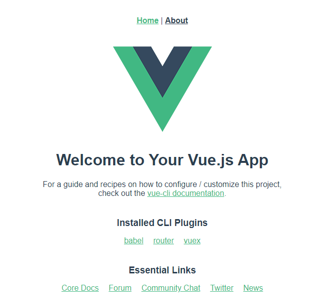

# 33. 关于Vue脚手架项目的端口

https://gitee.com/chengheng2022/jsd2207-csmall-web-client-teacher.git

启动Vue脚手架项目时，默认会尝试使用`8080`端口，如果此端口已经被占用，则会改为尝试使用`8081`端口，如果仍被占用，当会继续顺延。

为了避免每次启动时端口不一样，甚至如果先启动前端项目再启动后端项目，还会导致后端项目启动失败，强烈推荐显式的为前端项目和后端项目分别指定不同的端口号！

在后端项目（`jsd2207-csmall-product`）中，在`application-dev.yml`中添加配置：

```yaml
# 服务端口
server:
  port: 9080
```

在前端项目`jsd2207-csmall-web-client`中，在`package.json`文件中，将原有的在`scripts`下的`serve`的值由原本的`"vue-cli-service serve`改为`"vue-cli-service serve --port 9000"`，例如：

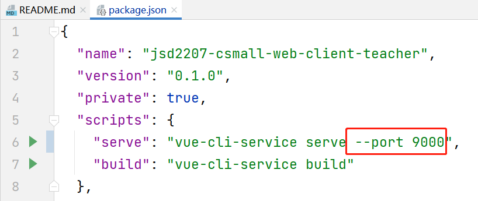

提示：前端项目启动后，没有停止按钮可用，需要在启动此项目的终端窗口中通过`Ctrl + C`来停止项目。

# 34. 关于视图组件

Vue脚手架项目是一个单页面的应用，即在整个项目中只有1个`.html`文件，此文件中的各个部分都是可以随时替换的，所以可以呈现出不同的显示效果，并且，Vue脚手架项目还会管理访问时的URL，即不同的显示效果可能对应不同的URL，以至于软件的使用者根本就体会不到这是个只有1个`.html`的项目。

在Vue脚手架项目中，以`.vue`为扩展名的文件称之为“视图组件”，将负责页面的显示，包括编写样式、JavaScript代码，一定程度上，与传统项目中的`.html`文件的作用是相似的。

在`.vue`文件中，主要由3部分组成：

- `<template>`：用于设计页面元素，即页面需要显示什么
  - 注意：此标签必须有且仅有1个直接子标签
- `<style>`：用于设计样式规则，即CSS
- `<script>`：用于编写JavaScript程序

# 35. 默认的页面效果

新创建的Vue脚手架项目已经是可以运行的，其运行效果相关的常用文件有：

- `src/App.vue`：是项目中唯一的`.html`文件默认绑定的视图组件，可理解为项目的入口视图组件，并且，此页面中设计的内容是始终显示的，在此视图中，有`<router-view/>`标签，此标签表示“将由其它视图组件来显示”
- `src/router/index.js`：是默认的**路由**配置文件，此文件中的`routes`常量配置了**路径**与**视图组件**的对应关系，决定了`<router-view/>`标签将由哪个视图组件来显示
  - 关于`routes`的配置：此属性是数组类型的，其中的各元素通常称之为一个个的“路由对象”，每个路由对象中主要配置`path`和`component`属性，即配置路径与视图组件的对应关系，关于`component`属性，如果某个视图是类似“主页”的定位，推荐通过`import`语句导入，否则，其它视图推荐使用`import()`函数导入


