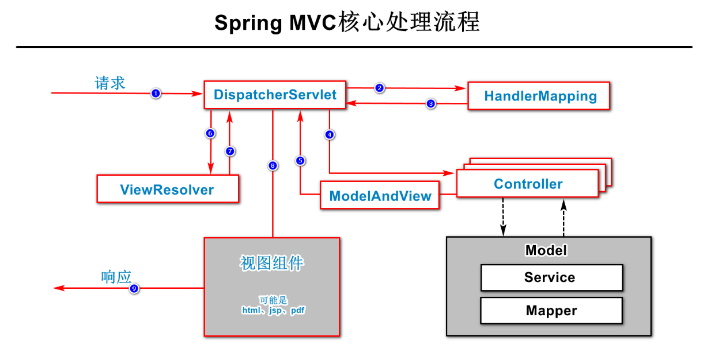
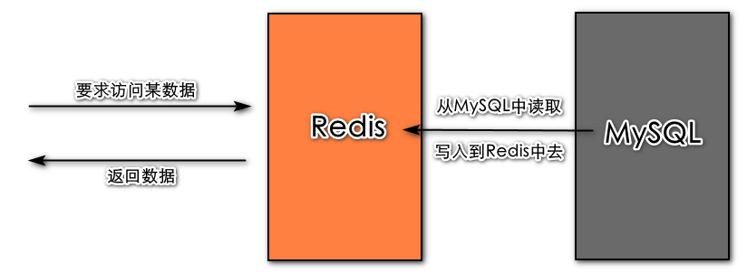

# 93. Spring MVC框架（续）

## 93.6. 响应结果

默认情况下，处理请求的方法的返回值将表示“处理响应结果的视图组件的名称，及相关的数据”，在Spring MVC中，有一种内置的返回值类型是`ModelAndView`，不是前后端分离的做法！

在处理请求的方法上，可以添加`@ResponseBody`注解，当添加此注解后，处理请求的方法的返回值将表示“响应的数据”，不再由服务器端决定视图组件，这种做法也叫做“响应正文”！这是前后端分离的做法！

`@ResponseBody`注解可以添加在处理请求的方法上，将作用于当前方法，也可以添加在控制器类上，将作用于控制器类中所有处理请求的方法！

控制器类需要添加`@Controller`注解，才是控制器类，或者，也可以改为添加`@RestController`，此注解是由`@Controller`和`@ResponseBody`组合而成的！所以，添加`@RestController`后，当前控制器类中所有处理请求的方法都是“响应正文”的！

当控制器处理请求需要响应正文时，Spring MVC框架会根据处理请求的方法的返回值类型，来决定使用某个`MessageConverter`（消息转换器），来将返回值转换为响应到客户端的数据，不同的返回值类型对应不同的消息转换器，例如，返回值类型是`String`时，Spring MVC框架将使用`StringHttpMessageConverter`，如果某个返回值类型是Spring MVC框架没有对应的消息转换器的，且当前项目添加了`jackson-databind`依赖项后，会自动使用此依赖项中的消息转换器，而`jackson-databind`中的消息转换器会将方法返回的结果转换为JSON格式的字符串！另外，如果当前项目是使用XML来配置Spring MVC框架的，还需要添加`<annotation-driven/>`标签以开启“注解驱动”，如果是使用注解进行配置的，则需要在配置类上添加`@EnableWebMvc`注解，如果是在Spring Boot中应用Spring MVC，不需要此配置！

## 93.7. 处理异常

添加了`@ExceptionHandler`注解的方法，就是处理异常的方法。

处理异常的方法到底处理哪种异常，由`@ExceptionHandler`注解参数或方法的参数中的异常类型来决定！如果`@ExceptionHandler`注解没有配置参数，由方法的参数中的异常类型决定，如果`@ExceptionHandler`注解配置了参数，由以注解参数中配置的类型为准！

处理异常的方法可以声明在控制器类，将只作用于当前控制器类中的方法抛出的异常！

通常，建议将处理异常的方法声明在专门的类中，并在此类上添加`@ControllerAdvice`注解，当添加此注解后，此类中特定的方法（例如处理异常的方法）将作用于每次处理请求的过程中！如果处理异常后的将“响应正文”，也可以在处理异常的方法上添加`@ResponseBody`注解，或在当前类上添加`@ResponseBody`，或使用`@RestControllerAdvice`取代`@ControllerAdvice`和`@ResponseBody`。

## 93.8. Spring MVC框架的核心执行流程

强烈建议抽时间看扩展视频教程！

# 94. Spring Boot框架

## 94.1. Spring Boot框架的作用

Spring Boot框架主要解决了统一管理依赖项与简化配置相关的问题。

**统一管理依赖项**：在开发实践中，项目中需要使用到的依赖项可能较多，在没有Spring Boot时，可能需要自行添加若干个依赖项，并且，需要自行保证这些依赖项的版本不会发生冲突，或保证不存在不兼容的问题，Spring Boot提供了`starter`依赖项（依赖项的名称中有`starter`字样），这种依赖项包含了使用某个框架时可能涉及的一系列依赖项，并处理好了各依赖项的版本相关问题，保证各依赖项的版本兼容、不冲突！例如`spring-boot-starter-web`就包含了Spring MVC的依赖项（`spring-webmvc`）、`jackson-databind`、`tomcat`等。

**简化配置**：Spring Boot默认完成了各项目中最可预测的配置，它是一种“约定大于配置”的思想，当然，这些配置也都是可以修改的，例如通过在`application.properties`中添加指定属性名的配置。

## 94.2. Spring Boot框架的依赖项

当项目中需要使用Spring Boot框架时，需要添加的基础依赖项是：`spring-boot-starter`。

此基础依赖项被其它各带有`starter`字样的依赖项所包含，所以，通常不必显式的添加此基础依赖项。

## 94.3. 典型的应用技巧

**关于日志**

在`spring-boot-starter`中已经包含`spring-boot-starter-logging`，所以，在添加任何`starter`依赖后，在项目中均可使用日志。

**关于配置文件**

Spring Boot项目默认在`src/main/resources`下已经准备好了配置文件，且Spring Boot默认识别的配置文件的文件名是`application`，其扩展名可以是`.properties`或`.yml`。

此配置文件会被Spring Boot自动读取，框架指定属性名称的各配置值会被自动应用，自定义的配置需要通过`Environment`对象或通过`@Value`注解自行读取并应用，所有不是指定属性名称的配置都是自定义配置。

其实，读取`.properties`配置文件是Spring框架做到的功能，而`.yml`配置是Spring框架并不支持的，但是，在Spring Boot中，添加了解析`.yml`文件的依赖项，所以，在Spring Boot中既可以使用`.properties`也可以使用`.yml`。

另外，Spring Boot还很好的支持了Profile配置（也是Spring框架做到的功能）。

# 95. 注解

| 注解                          | 所属框架          | 作用                                                         |
| ----------------------------- | ----------------- | ------------------------------------------------------------ |
| `@ComponentScan`              | Spring            | 添加在配置类上，开启组件扫描。 如果没有配置包名，则扫描当前配置类所在的包， 如果配置了包名，则扫描所配置的包及其子孙包 |
| `@Component`                  | Spring            | 添加在类上，标记当前类是组件类，可以通过参数配置Spring Bean名称 |
| `@Controller`                 | Spring            | 添加在类上，标记当前类是控制器组件类，用法同`@Component`     |
| `@Service`                    | Spring            | 添加在类上，标记当前类是业务逻辑组件类，用法同`@Component`   |
| `@Repository`                 | Spring            | 添加在类上，标记当前类是数据访问组件类，用法同`@Component`   |
| `@Configuration`              | Spring            | 添加在类上，仅添加此注解的类才被视为配置类，通常不配置注解参数 |
| `@Bean`                       | Spring            | 添加在方法上，标记此方法将返回某个类型的对象， 且Spring会自动调用此方法，并将对象保存在Spring容器中 |
| `@Autowired`                  | Spring            | 添加在属性上，使得Spring自动装配此属性的值 添加在构造方法上，使得Spring自动调用此构造方法 添加在Setter方法上，使得Spring自动调用此方法 |
| `@Qualifier`                  | Spring            | 添加在属性上，或添加在方法的参数上， 配合自动装配机制，用于指定需要装配的Spring Bean的名称 |
| `@Scope`                      | Spring            | 添加在组件类上，或添加在已经添加了`@Bean`注解的方法上， 用于指定作用域，注解参数为`singleton`（默认）时为“单例”，注解参数为`prototype`时为“非单例” |
| `@Lazy`                       | Spring            | 添加在组件类上，或添加在已经添加了`@Bean`注解的方法上， 用于指定作用域，当Spring Bean是单例时，注解参数为`true`（默认）时为“懒加载”，注解参数为`false`时为“预加载” |
| `@Resource`                   | Spring            | 此注解是`javax`包中的注解， 添加在属性上，使得Spring自动装配此属性的值， 通常不推荐使用此注解 |
| `@ResponseBody`               | Spring MVC        | 添加在方法上，标记此方法是“响应正文”的， 添加在类上，标记此类中所有方法都是“响应正文”的 |
| `@RestController`             | Spring MVC        | 添加在类上，标记此类是一个“响应正文”的控制器类               |
| `@RequestMapping`             | Spring MVC        | 添加在类上，也可以添加在处理请求的方法上， 通常用于配置请求路径 |
| `@GetMapping`                 | Spring MVC        | 添加在方法上，是将请求方式限制为`GET`的`@RequestMapping`     |
| `@PostMapping`                | Spring MVC        | 添加在方法上，是将请求方式限制为`POST`的`@RequestMapping`    |
| `@DeleteMapping`              | Spring MVC        | 添加在方法上，是将请求方式限制为`DELETE`的`@RequestMapping`  |
| `@PutMapping`                 | Spring MVC        | 添加在方法上，是将请求方式限制为`PUT`的`@RequestMapping`     |
| `@RequestParam`               | Spring MVC        | 添加在请求参数上，可以： 1. 指定请求参数名称 2. 要求必须提交此参数 3. 指定请求参数的默认值 |
| `@PathVariable`               | Spring MVC        | 添加在请求参数上，用于标记此参数的值来自URL中的占位符，如果URL中的占位符名称与方法的参数名称不同，需要配置此注解参数来指定URL中的占位符名称 |
| `@RequestBody`                | Spring MVC        | 添加在请求参数上，用于标记此参数必须是对象格式的参数，如果未添加此注解，参数必须是FormData格式的 |
| `@ExceptionHandler`           | Spring MVC        | 添加在方法上，标记此方法是处理异常的方法，可以通过配置注解参数来指定需要处理的异常类型，如果没有配置注解参数，所处理的异常类型取决于方法的参数列表中的异常类型 |
| `@ControllerAdvice`           | Spring MVC        | 添加在类上，标记此类中特定的方法将作用于每次处理请求的过程中 |
| `@RestControllerAdvice`       | Spring MVC        | 添加在类上，是`@ControllerAdvice`和`@ResponseBody`的组合注解 |
| `@MapperScan`                 | Mybatis           | 添加在配置类上，用于指定Mapper接口的根包，Mybatis将根据此根包执行扫描，以找到各Mapper接口 |
| `@Mapper`                     | Mybatis           | 添加在Mapper接口上，用于标记此接口是Mybatis的Mapper接口，如果已经通过`@MapperScan`配置能够找到此接口，则不需要使用此注解 |
| `@Param`                      | Mybatis           | 添加在Mapper接口中的抽象方法的参数上，用于指定参数名称，当使用此注解指定参数名称后，SQL中的`#{}` / `${}`占位符中的名称必须是此注解指定的名称，通常，当抽象方法的参数超过1个时，强烈建议在每个参数上使用此注解配置名称 |
| `@Select`                     | Mybatis           | 添加在Mapper接口的抽象方法上，可以通过此注解直接配置此抽象方法对应的SQL语句（不必将SQL语句配置在XML文件中），用于配置`SELECT`类的SQL语句，但是，非常不推荐这种做法 |
| `@Insert`                     | Mybatis           | 同上，用于配置`INSERT`类的SQL语句                            |
| `@Update`                     | Mybatis           | 同上，用于配置`UPDATE`类的SQL语句                            |
| `@Delete`                     | Mybatis           | 同上，用于配置`DELETE`类的SQL语句                            |
| `@Transactional`              | Spring JDBC       | 推荐添加的业务接口上，用于标记此接口中所有方法都是事务性的，或业务接口中的抽象方法上，用于此方法是事务性的 |
| `@SpringBootApplication`      | Spring Boot       | 添加在类上，用于标记此类是Spring Boot的启动类，每个Spring Boot项目应该只有1个类添加了此注解 |
| `@SpringBootConfiguration`    | Spring Boot       | 通常不需要显式的使用，它是`@SpringBootApplication`的元注解之一 |
| `@SpringBootTest`             | Spring Boot       | 添加在类上，用于标记此类是加载Spring环境的测试类             |
| `@Valid`                      | Spring Validation | 添加在方法的参数上，标记此参数需要经过Validation框架的检查   |
| `@Validated`                  | Spring Validation | 添加在方法的参数上，标记此参数需要经过Validation框架的检查；添加在类上，并结合方法上的检查注解（例如`@NotNull`等）实现对未封装的参数的检查 |
| `@NotNull`                    | Spring Validation | 添加在需要被检查的参数上，或添加在需要被检查的封装类型的属性上，用于配置“不允许为`null`”的检查规则 |
| `@NotEmpty`                   | Spring Validation | 使用位置同`@NotNull`，用于配置“不允许为空字符串”的检查规则   |
| `@NotBlank`                   | Spring Validation | 使用位置同`@NotNull`，用于配置“不允许为空白”的检查规则       |
| `@Pattern`                    | Spring Validation | 使用位置同`@NotNull`，用于配置正则表达式的检查规则           |
| `@Range`                      | Spring Validation | 使用位置同`@NotNull`，用于配置“数值必须在某个取值区间”的检查规则 |
| `@Api`                        | Knife4j           | 添加在控制器类上，通过此注解的`tags`属性配置API文档中的模块名称 |
| `@ApiOperation`               | Knife4j           | 添加在控制器类中处理请求的方法上，用于配置业务名称           |
| `@ApiOperationSupport`        | Knife4j           | 添加在控制器类中处理请求的方法上，通过此注解的`order`属性配置业务显示在API文档中时的排序序号 |
| `@ApiModelProperty`           | Knife4j           | 添加在封装的请求参数类型中的属性上，用于配置请求参数的详细说明，包括：名称、数据类型、是否必须等 |
| `@ApiImplicitParam`           | Knife4j           | 添加在控制器类中处理请求的方法上，用于配置请求参数的详细说明，包括：名称、数据类型、是否必须等 |
| `@ApiImplicitParams`          | Knife4j           | 添加在控制器类中处理请求的方法上，如果需要通过`@ApiImplicitParam`注解配置的参数超过1个，则必须将多个`@ApiImplicitParam`注解作为此注解的参数 |
| `@ApiIgnore`                  | Knife4j           | 添加在请求参数上，用于标记API文档中将不关心此参数            |
| `@EnableGlobalMethodSecurity` | Spring Security   | 添加在配置类上，用于开启全局的方法级别的权限控制             |
| `@PreAuthorize`               | Spring Security   | 添加在方法上，用于配置权限                                   |
| `@AuthenticationPrincipal`    | Spring Security   | 添加在方法的参数上，且此参数应该是Security上下文中的认证信息中的当事人类型，用于为此参数注入值 |
| `@Data`                       | Lombok            | 添加在类上，将在编译期生成此类中所有属性的Setter、Getter方法，及`hashCode()`、`equals()`、`toString()`方法 |
| `@Setter`                     | Lombok            | 添加在类上，将在编译期生成此类中所有属性的Setter方法，也可以添加在类的属性上，将在编译期生成此属性的Setter方法 |
| `@Getter`                     | Lombok            | 添加在类上，将在编译期生成此类中所有属性的Getter方法，也可以添加在类的属性上，将在编译期生成此属性的Getter方法 |
| `@EqualsAndHashcode`          | Lombok            | 添加在类上，将在编译期生成基于此类中所有属性的`hashCode()`、`equals()`方法 |
| `@ToString`                   | Lombok            | 添加在类上，将在编译期生成基于此类中所有属性的`toString()`方法 |
| `@NoArgConstructor`           | Lombok            | 添加在类上，将在编译期生成此类的无参数构造方法               |
| `@AllArgsConstructor`         | Lombok            | 添加在类上，将在编译期生成基于此类中所有属性的全参构造方法   |

# 96. Redis

Redis是一款基于内存来读写数据的NoSQL非关系型数据库

- 基于内存的：Redis访问的数据都在内存中
  - Redis的读写效率非常高
  - 其实Redis也会自动的处理持久化，但是正常读写都是在内存中执行的

- NoSQL：不涉及SQL语句，`No`可理解为日常英语中的`no`（没有），也可理解为`No Operation`（不操作）
- 非关系型数据库：不关心数据库中存储的是什么数据，几乎没有数据种类的概念，更不存在数据与数据之间的关联

通常，在项目中，Redis用于实现缓存！

当使用Redis后：

- 【优点】读取数据的效率会高很多
- 【优点】能够一定程度上保障缓解数据库的查询压力，提高数据库的安全性
- 【缺点】

