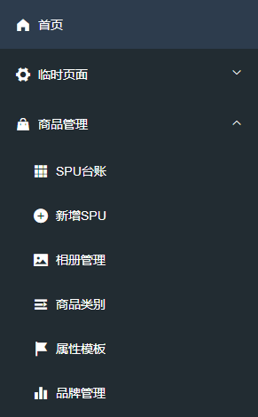

# DAY01（10.24）

在`product`项目中实现以下表的“插入1条数据”的功能：

- 品牌表（`pms_brand`）
- 类别表（`pms_category`）

提示，可通过 https://gitee.com/chengheng2022/jsd2206-csmall-product-teacher 参考。

# DAY02（10.25）

在`product`项目中实现品牌表（`pms_brand`）、类别表（`pms_category`）、属性模板表（`pms_attribute_template`）的功能：

- 插入1条数据
  - 已经完成的不必重复编写
- 批量插入数据
- 根据id删除某1条数据
- 根据若干个id批量删除某些数据
- 根据id修改数据
- 统计当前表中数据的数量
- 根据id查询数据详情
- 查询当前表中的数据列表

# DAY03（10.26）

在`product`项目中实现：

- 添加品牌的业务，业务规则：品牌名称必须唯一
- 添加品牌的控制器，要求可以通过某个URL进行测试访问
- 添加类别的业务，业务规则：类别名称必须唯一
- 添加类别的控制器，要求可以通过某个URL进行测试访问

# DAY04（10.27）

安装Node.js，老师的项目中的教程。

在`product`项目中实现：

- 添加属性模板的业务，业务规则：品牌名称必须唯一
- 添加属性模板的控制器，要求可以通过某个URL进行测试访问
- 配置品牌的控制器、类别的控制器、属性模板的控制器的API文档

# DAY05（10.28）

在`product`项目中实现：

- 补全：共计12张数据表，每张表的Mapper层，即完成8个基础的数据访问功能

在`web-client`项目中实现：

- 补全：在`HomeView`中补全菜单项，不要求修改外观，也不要求菜单项可以点击打开页面，只需要显示出各菜单项即可，如下图所示：

  




提示：其它菜单项暂未设计子级。

# DAY06（10.31）

在`csmall-web-client`（前端项目）中设计以下页面：

- 添加品牌（BrandAddNewView.vue）


提示：以上“是否启用”是通过“开关”控件实现的，可参考：https://element.eleme.cn/#/zh-CN/component/switch

- 添加类别（CategoryAddNewView.vue）

  

- 添加属性模板（AttributeTemplateAddNewView.vue）


- 添加属性（AttributeAddNewView.vue）

  

  提示：以上表单中，“属性模板”的控件是“Select选择器”，可参考：https://element.eleme.cn/#/zh-CN/component/select

  提示：以上表单中，“类型”和“输入类型”的控件是“Radio单选框”，可参考：https://element.eleme.cn/#/zh-CN/component/radio

  提示：以上表单中，“类型”的值的右侧的“i”是通过图标显示的（可参考菜单项的图标），并且，鼠标移上去可以显示一段文本，显示文本可参考：https://element.eleme.cn/#/zh-CN/component/tooltip

- 添加管理员（AdminAddNewView.vue）


# DAY07（11.01）

在`csmall-product`项目中实现：

- 补充业务规则：根据id删除相册时，如果存在关联的SPU数据，则不允许删除，将抛出异常，此关联数据表现在`pms_spu`表的`album_id`字段
- 根据id删除品牌（Brand）数据--业务层
  - 业务规则：数据必须存在，否则抛出异常（ERR_NOT_FOUND）
  - 业务规则：不允许存在关联的品牌数据，否则抛出异常（ERR_CONFLICT），此关联数据表现在`pms_brand_category`表的`brand_id`字段
  - 业务规则：不允许存在关联的SPU数据，否则抛出异常（ERR_CONFLICT），此关联数据表现在`pms_spu`表的`brand_id`字段
- 根据id删除品牌（Brand）数据--控制器层
  - URL格式参考：`/brands/9527/delete`
  - 要求配置API文档的显示文本
  - 可不配置检查请求参数的基本格式
- 根据id删除属性模板（AttributeTemplate）数据--业务层
  - 业务规则：数据必须存在，否则抛出异常（ERR_NOT_FOUND）
  - 业务规则：不允许存在关联的属性数据，否则抛出异常（ERR_CONFLICT），此关联数据表现在`pms_attribute`表的`template_id`字段
  - 业务规则：不允许存在关联的类别数据，否则抛出异常（ERR_CONFLICT），此关联数据表现在`pms_category_attribute_template`表的`attribute_template_id`字段
  - 业务规则：不允许存在关联的SPU数据，否则抛出异常（ERR_CONFLICT），此关联数据表现在`pms_spu`表的`attribute_template_id`字段
- 根据id删除属性模板（AttributeTemplate）数据--控制器层
  - URL格式参考：`/attribute-templates/9527/delete`
  - 要求配置API文档的显示文本
  - 可不配置检查请求参数的基本格式

# DAY08（11.02）

在`csmall-web-client`项目中实现：

- 显示品牌列表（在`mounted`时加载列表并显示）
  - 补充必要的服务器端代码
- 删除品牌（点击列表中的某品牌，经过再次确认后，执行删除）
- 显示属性模板列表（同上）
  - 补充必要的服务器端代码
- 删除属性模板（同上）

# DAY09（11.03）

在`csmall-passport`项目中实现：

- 补全Mapper层对`ams_admin`表的8个基础数据访问功能
  - 8个功能，可参考DAY02作业

在`csmall-product`项目中实现：

- 添加属性--Service层

  - 业务逻辑：同一个属性模板下，属性名称必须唯一

    - 提示：`pms_attribute`表的`template_id`字段表示属性归属于哪个属性模板

    - 提示：在补充抽象方法时，此抽象方法需要2个参数，则各参数之前应该添加`@Param`注解

    - ```java
      int countByNameAndTemplateId(@Param("name") String name, @Param("templateId") Long templateId);
      ```

    - ```mysql
      select count(*) from pms_attribute where name=? and template_id?
      ```

- 添加属性--Controller层

- 添加属性--前端页面

  - 提示：此页面应该在DAY06已完成
  - 在此页面的`mounted`生命周期中，需加载属性模板列表，以显示下拉列表
  - 参考：https://gitee.com/chengheng2022/jsd2206-csmall-web-client-teacher/blob/master/src/views/sys-admin/temp/AttributeAddNewView.vue

# DAY10（11.04）

在`csmall-web-client`和`csmall-product`项目中实现：

- 通过页面设置数据状态：启用品牌、禁用品牌
- 通过页面设置数据状态：启用类别、禁用类别
- 通过页面设置数据状态：将类别显示在导航栏、将类别隐藏（不显示在导航栏）
  - “显示”：`display`
  - “隐藏”：`hidden`

提示：关于显示类别列表，按照显示品牌列表的模式操作即可，也不必考虑分页问题，后续会优化

# DAY11（11.07）

无

# DAY12（11.08）

请思考以下问题，并通过文本文档提交答案：

- Spring Security框架主要解决了什么问题？
- BCrypt算法的主要特点是什么？
- UUID的主要特点是什么？
- 在继承了`WebSecurityConfigurerAdapter`的配置类中，重写`void configurer(HttpSecurity http)`方法
  - `http.formLogin()`方法的作用是什么？
  - 配置请求认证的过程中，调用的`mvcMatchers()`方法的作用是什么？
  - 配置请求认证的过程中，调用的`permitAll()`方法的作用是什么？
  - 配置请求认证的过程中，如果某个路径被多次匹配，最终此路径的规则是什么？
  - `http.csrs().disable()`的作用是什么？
- `UserDetailsService`的作用是什么？
- 如果得到`AuthenticationManager`对象？
- 当调用`AuthenticationManager`对象的`authenticate()`方法后，会发生什么？此方法的返回结果是什么？
- Spring Security如何判定某个请求是否已经通过认证？